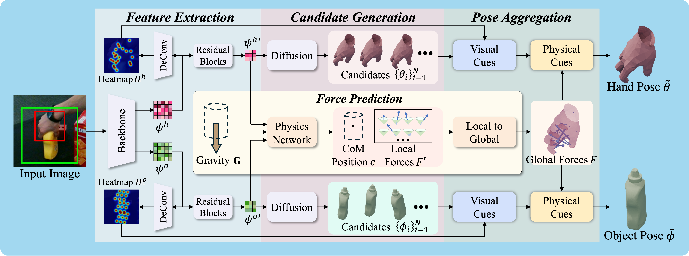
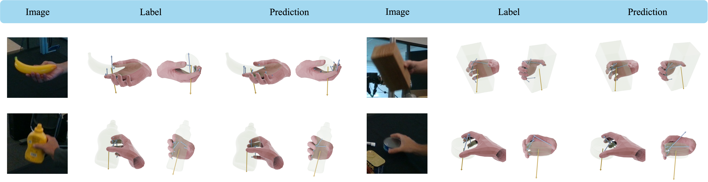

# VPHO

Official repository for the AAAI 2026 paper [**VPHO: Joint Visual-Physical Cue Learning and Aggregation for Hand-Object Pose Estimation**](https://arxiv.org/abs/2511.12030)

## Overview

VPHO is a method for hand-object pose estimation that jointly learns and aggregates visual and physical cues. This repository contains the implementation code and pseudo force data.



## Prerequisites

- Python 3.10
- CUDA 12.1+
- Conda package manager

## Installation

1. Clone this repository:
```bash
git clone https://github.com/zhoujun-7/VPHO
cd VPHO
```

2. Create the conda environment:
```bash
conda env create -f environment.yaml
conda activate vpho
```

3. Download the DexYCB dataset:
   - Follow the steps on the [official DexYCB website](https://dex-ycb.github.io/) to download the dataset.

4. Download additional resources:
   - Download `asset`, `checkpoint`, and `cache` directories from:
     - [Google Drive](https://drive.google.com/drive/folders/1WOch7n3Op9IPN_2Eyd_daWKJ5QH_PC44?usp=sharing)
     - [Baidu Netdisk](https://pan.baidu.com/s/1ubBPkW9jyqf3BFNxWifQ_g?pwd=vpho)
   - Extract the downloaded files:
     - Place `asset` and `checkpoint` directories in the `VPHO` directory
     - Place `cache` directory in the DexYCB data directory

## Usage

### Training

To train the VPHO model:

```bash
accelerate launch --config_file lib/configs/ddp01.yaml \
    main.py \
    --mode train \
    --model vpho_net \
    --random_seed 206
```

### Evaluation

To evaluate the model:

```bash
accelerate launch --config_file lib/configs/single.yaml \
    main.py \
    --mode eval \
    --model vpho_net \
    --sample_T0 0.65 \
    --sample_num 100 \
    --topk_hand 30 \
    --topk_obj 10 \
    --batch_size 64 \
    --sampling_steps 50 \
    --checkpoint <path_to_checkpoint>/epoch_45.state
```

**Note:** Replace `<path_to_checkpoint>` with the actual path to your checkpoint file.

### Output

- Logging files and visualization data are saved to `./output`
- We recommend using [Batch3D](https://github.com/KaifengT/Batch3D) to visualize the predicted 3D results in `.pkl` format

## Citation

If you find this project useful, please consider citing:

```bibtex
@misc{AAAI26-VPHO,
    title={VPHO: Joint Visual-Physical Cue Learning and Aggregation for Hand-Object Pose Estimation}, 
    author={Jun Zhou and Chi Xu and Kaifeng Tang and Yuting Ge and Tingrui Guo and Li Cheng},
    year={2025},
    eprint={2511.12030},
    archivePrefix={arXiv},
    primaryClass={cs.CV},
    url={https://arxiv.org/abs/2511.12030}
}
```

## Acknowledgement

We thank the following excellent projects:

- [Batch3D](https://github.com/KaifengT/Batch3D)
- [AmbiguousHPE](https://github.com/GYTuuT/AmbiguousHPE)
- [HFL](https://github.com/lzfff12/HFL-Net)
- [DeepSimHO](https://github.com/rongakowang/DeepSimHO)
- [CPF](https://github.com/lixiny/CPF)
- [GenPose](https://github.com/Jiyao06/GenPose)

## Contact

Please feel free to contact us if you have any questions or encounter any issues.